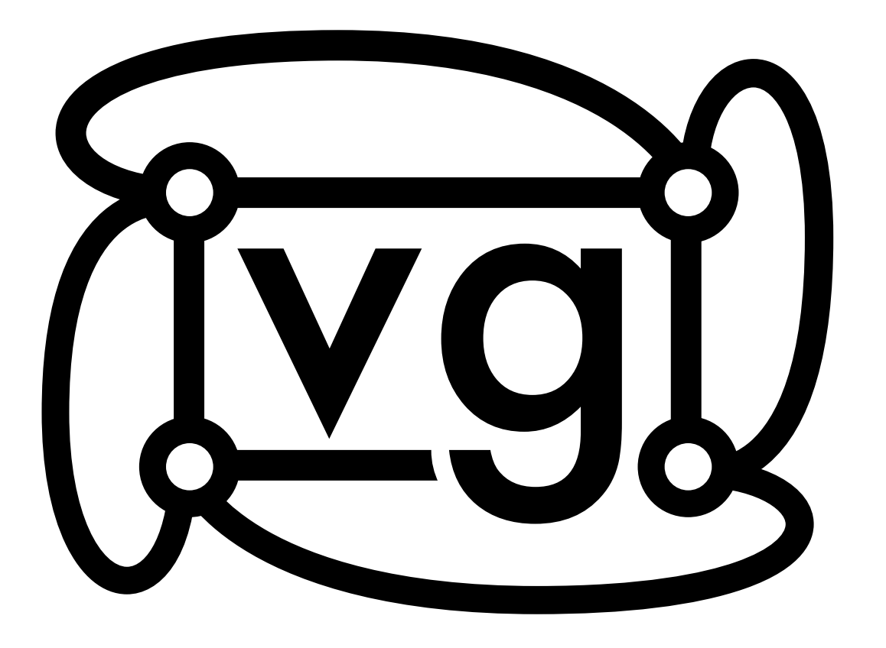
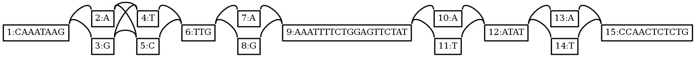
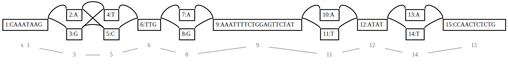
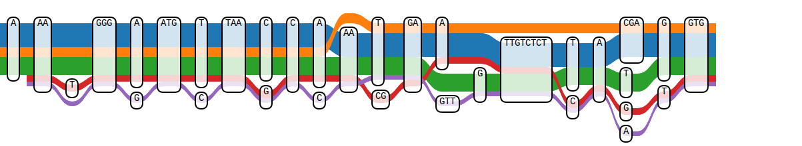
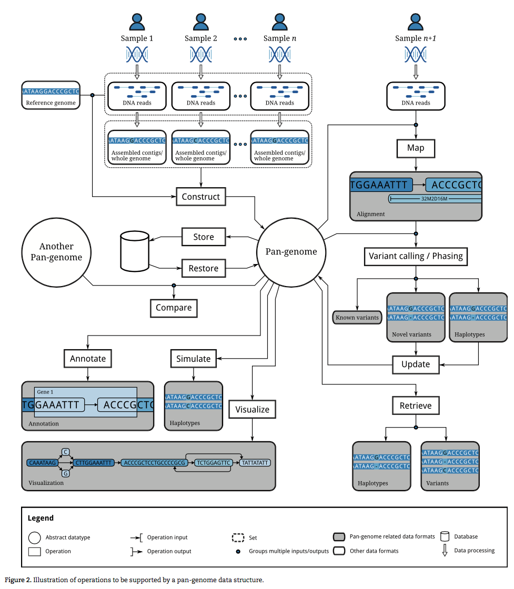

# VG cheat sheet 2017

How to construct, modify and view a variation graph with vg?



### Toshiaki Katayama <ktym@dbcls.jp>
### Erik Garrison <erik.garrison@gmail.com>

Best viewed on [Marp](https://github.com/yhatt/marp)

---

# Create a graph

From a multi FASTA sequences file:

```sh
% vg msga -f multi.fa > graph.vg
```

From a reference sequence FASTA file + VCF file:

```sh
% vg construct -r ref.fa -v var.vcf > graph.vg
```

If `--alt-paths` (`-a`) option is given, all variants in VCF will be treated as (very short) paths (one base length path for each SNP).

```sh
% vg construct -a -r ref.fa -v var.vcf > graph.vg
```

Note that, `vg` can consume FASTA, [VCF](https://vcftools.github.io/specs.html) and [GFA1](https://github.com/GFA-spec/GFA-spec) format files only.

---

# Modify a graph

Add variations in a VCF file to a graph by `vg add` with `-v` option:

```sh
% vg msga -f multi.fasta > old.vg
% vg add -v add.vcf old.vg > new.vg
```

Path names are teken from FASTA identifiers by default. So, if you want to have multiple paths in a graph, you need to feed multiple sequences to `vg msga`.

---

# View a graph (as an image)

Output as PNG file (via a Graphviz `dot` command):

```sh
% vg view -d graph.vg | dot -Tpng -o graph.png
```



Output as SVG file (via a Graphviz `dot`) with paths (`-p` option):

```sh
% vg view -dp graph.vg | dot -Tsvg -o graph.svg
```



---

# View a graph (for apps)

As a JSON format (use `jq` to make the output human friendly):

```sh
% vg view -j graph.vg
{"node": [{"sequence": "CAAATAAG", "id": 1}, {"sequence": "A", "id": 2}, {"sequence": "G", "id": 3}, {"sequence": "T", "id": 4}, {"sequence": "C", "id": 5}, {"sequence": "TTG", "id": 6}, {"sequence": "A", "id": 7}, {"sequence": "G", "id": 8}, {"sequence": "AAATTTTCTGGAGTTCTAT", "id": 9}, {"sequence": "A", "id": 10}, {"sequence": "T", "id": 11}, {"sequence": "ATAT", "id": 12}, {"sequence": "A", "id": 13}, {"sequence": "T", "id": 14}, {"sequence": "CCAACTCTCTG", "id": 15}], "edge": [{"from": 1, "to": 2}, {"from": 1, "to": 3}, {"from": 2, "to": 4}, {"from": 3, "to": 4}, {"from": 2, "to": 5}, {"from": 3, "to": 5}, {"from": 4, "to": 6}, {"from": 5, "to": 6}, {"from": 6, "to": 7}, {"from": 6, "to": 8}, {"from": 7, "to": 9}, {"from": 8, "to": 9}, {"from": 9, "to": 10}, {"from": 9, "to": 11}, {"from": 10, "to": 12}, {"from": 11, "to": 12}, {"from": 12, "to": 13}, {"from": 12, "to": 14}, {"from": 13, "to": 15}, {"from": 14, "to": 15}], "path": [{"name": "x", "mapping": [{"edit": [{"from_length": 8, "to_length": 8}], "position": {"node_id": 1}, "rank": 1}, {"edit": [{"from_length": 1, "to_length": 1}], "position": {"node_id": 3}, "rank": 2}, {"edit": [{"from_length": 1, "to_length": 1}], "position": {"node_id": 5}, "rank": 3}, {"edit": [{"from_length": 3, "to_length": 3}], "position": {"node_id": 6}, "rank": 4}, {"edit": [{"from_length": 1, "to_length": 1}], "position": {"node_id": 8}, "rank": 5}, {"edit": [{"from_length": 19, "to_length": 19}], "position": {"node_id": 9}, "rank": 6}, {"edit": [{"from_length": 1, "to_length": 1}], "position": {"node_id": 11}, "rank": 7}, {"edit": [{"from_length": 4, "to_length": 4}], "position": {"node_id": 12}, "rank": 8}, {"edit": [{"from_length": 1, "to_length": 1}], "position": {"node_id": 14}, "rank": 9}, {"edit": [{"from_length": 11, "to_length": 11}], "position": {"node_id": 15}, "rank": 10}]}]}
```

```sh
% vg view -j graph.vg | jq
{ "path": [
    { "name": "x",
      "mapping": [
        { "position": { "node_id": 1 },
          "edit": [
            { "from_length": 8,
              "to_length": 8
            }
          ],
          "rank": 1
        },
  :
```

---

# View a graph (in web app)

View on the Tube Maps web application (via JSON output)

```sh
% vg view -j graph.vg > graph.json
```

Just upload JSON to https://wolfib.github.io/sequenceTubeMap/ at the Use Custom Data tab.



---

# View a graph (default)

As a GFA (Graphical Fragment Assembly) format:

```sh
% vg view graph.vg
H	VN:Z:1.0
P	x	1+,3+,5+,6+,8+,9+,11+,12+,14+,15+	8M,1M,1M,3M,1M,19M,1M,4M,1M,11M
S	1	CAAATAAG
L	1	+	2	+	0M
L	1	+	3	+	0M
S	2	A
L	2	+	4	+	0M
L	2	+	5	+	0M
S	3	G
L	3	+	4	+	0M
L	3	+	5	+	0M
S	4	T
L	4	+	6	+	0M
S	5	C
  :
```

---

# Application of vg in analysis pipeline

* vg construct - create a reference graph
* vg find - extract regions of interest
* vg sim - sample reads from simulation
* vg annotate - ??
* vg map - read alignment
* vg pileup - read depth
* vg call - variant calling
* vg mod - update reference
* vg view - visualization


Figure: Brifings in Bioinformatics 2016, doi:10.1093/bib/bbw089




---

# Sub graph extraction

`xg` index created by `vg index` with `-x` option is used to find nodes and edges on a path (chr1) at a 0-based base position (123) or a region from (123) - to (456) bases.

```sh
% vg index -x graph.xg graph.vg
% vg find -x graph.xg -p chr1:123 | vg view -
{"node": [{"sequence": "CAAATAAG", "id": 1}], "edge": [{"from": 1, "to": 2}, {"from": 1, "to": 3}], "path": [{"name": "x", "mapping": [{"position": {"node_id": 1}, "rank": 1}]}]}
```

```sh
% vg find -x graph.xg -p chr1:123-456 | vg view -j - | jq
{ "node": [ { "sequence": "CCAACTCTCTG", "id": 15 } ],
  "edge": [ { "from": 13, "to": 15 }, { "from": 14, "to": 15 } ],
  "path": [
    { "name": "chr1",
      "mapping": [
        { "position": { "node_id": 15 },
          "rank": 10
        }
      ]
  :
```

---

# Sequence matching

`GCSA2` index created by `vg index` with `-g` option is used to find nodes and positions which contains a given sub-sequence (need to specify the order of the De Bruijn graph with `-k` option).

```sh
% vg index -k 16 -g graph.gcsa graph.vg
% vg find -g graph.gcsa -S GAGT
9:10
15:-4
```

This means, sequences starting from

* the 11th base (10+1) on the node 9 and 
* the 5th base (4+1) of the reverse complement strand on the node 15

match with the query (note that base count is 0-based).


<!--
TODO: why vg find -g tiny.gcsa -S CAA returns same results twice or more? => fixed 2017/5/2
# vg find -g tiny.gcsa -S CAA 
6:-0
1:0
6:-0
15:1
6:-0
-->

---

# Read mapping

First, generate some simulated reads with length 30 for test.

```sh
% vg sim -n 2 -l 30 -x graph.xg graph.vg
TGGAATATTATAGAACTCCAGAAAATTTTC
TATAGAACTCCAGAAAATTTCCAAGCCTTA
```

Then map one of those reads and store the results in a [GAM](https://github.com/vgteam/vg/wiki/File-Formats) format file (GAM is vg's BAM equivalent).

```sh
% vg map -g graph.gcsa -x graph.xg -s TGGAATATTATAGAACTCCAGAAAATTTTC > graph.gam
% vg view -a graph.gam
{"mapping_quality": 60, "sequence": "TGGAATATTATAGAACTCCAGAAAATTTTC", "identity": 1.0, "path": {"mapping": [{"position": {"offset": 8, "node_id": 15, "is_reverse": true}, "edit": [{"from_length": 3, "to_length": 3}], "rank": 1}, {"position": {"node_id": 14, "is_reverse": true}, "edit": [{"from_length": 1, "to_length": 1}], "rank": 2}, {"position": {"node_id": 12, "is_reverse": true}, "edit": [{"from_length": 4, "to_length": 4}], "rank": 3}, {"position": {"node_id": 10, "is_reverse": true}, "edit": [{"from_length": 1, "to_length": 1}], "rank": 4}, {"position": {"node_id": 9, "is_reverse": true}, "edit": [{"from_length": 19, "to_length": 19}], "rank": 5}, {"position": {"node_id": 7, "is_reverse": true}, "edit": [{"from_length": 1, "to_length": 1}], "rank": 6}, {"position": {"node_id": 6, "is_reverse": true}, "edit": [{"from_length": 1, "to_length": 1}], "rank": 7}]}, "score": 30}
```

Note that, the `-d` option is provided as a shortcut to specify a prefix for `.xg` and `.gcsa` index files.

```sh
% vg map -d graph -s TGGAATATTATAGAACTCCAGAAAATTTTC -j
```

---

# Multiple read mapping

Generates more simulated reads.

```sh
% vg sim -l 30 -n 100 -x graph.xg graph.vg > graph.reads
```

Then map those reads to a graph.

```sh
% vg map -d graph -T graph.reads > graph.gam
```

And make a pileup.

```sh
% vg pileup graph.vg graph.gam > graph.pileup
```

Then call the result into VCF file.

```sh
% vg call graph.vg graph.pileup > call.vcf
```

---

# RDF/Turtle dump of a graph (SemWeb)

```sh
% vg view -t graph.vg > graph.ttl
```

Schema of [RDF for VG](https://github.com/vgteam/vg/wiki/RDF:-for-VG) consists of three classes and predicates.
* `:Node` node:1 (http://example.org/vg/node/1)
  * `rdf:value` "ATGC" (DNA sequence fragment)
  * `:linksForwardToForward`, `:linksForwardToReverse`, `:linksReverseToForward`, `:linksReverseToReverse` node:2
* `:Step` step:x-1 (http://example.org/vg/step/x-1)
  * `:path` path:x (path identifier; arbitrary)
  * `:node` node:1 (node identifier; 1-based)
  * `:rank` 1 (order of the nodes on the path; 1-based)
  * `:position` 0 (sequence position on the path; 0-based)
* `:Path` path:x (http://example.org/vg/path/x)

---

# SPARQL for RDF graph

RDF model contains all the variation graph structure and sequences of nodes, which can be concatenated in the order of rank of steps along with the path to reconstruct the original sequence.

```sparql
PREFIX vg: <http://example.org/vg/>
PREFIX rdf: <http://www.w3.org/1999/02/22-rdf-syntax-ns#>
SELECT ?path (GROUP_CONCAT(?subseq; separator='') AS ?sequence)
WHERE {
  ?step vg:path ?path ;
        vg:node ?node ;
        vg:rank ?rank .
  ?node rdf:value ?subseq .
}
GROUP BY ?path
ORDER BY ?rank
```

---

# Installation

## Codebase: https://github.com/vgteam/vg/

```sh
% git clone https://github.com/vgteam/vg.git
```

### VG docker: https://github.com/vgteam/vg_docker

It is recommended to use Docker for resolving dependencies (need to give >3~4GB memory to docker; 2GB was not enough to build).

```sh
% git clone https://github.com/vgteam/vg_docker.git
% cd vg_docker
% docker build -t vg -f Dockerfile.build .
```

You may want to add following line to Dockerfile for handling VCF files and PNG/SVG image outputs:

```
RUN apt-get install -y tabix graphviz
```

---

# Running vg on docker

Suppose if you tagged (named) the image as `vg` and mount the `~/vg` folder in your home directory to `/opt` inside the docker:

``` sh
% docker run --rm -t -i -v ~/vg:/opt vg /bin/bash
```

You can put your data files in the `/opt` directory (`~/vg` on the host) to make them persistent.

```sh
root@e7de87ec79ea:/vg# vg
vg: variation graph tool, version v1.5.0-272-g187be7c

usage: vg <command> [options]

commands:
  -- add           add variants from a VCF to a graph
  -- annotate      annotate alignments with graphs and graphs with alignments
  :
```

---

# Other options

```
usage: vg <command> [options]

commands:
  -- add           add variants from a VCF to a graph
  -- annotate      annotate alignments with graphs and graphs with alignments
  -- call          call variants on a graph from a pileup
  -- chunk         split graph or alignment into chunks
  -- construct     graph construction
  -- explode       split graph into connected components
  -- genotype      Genotype (or type) graphs, GAMS, and VCFs.
  -- homogenize    homogenize augmented graphs
  -- index         index graphs or alignments for random access or mapping
  -- mod           filter, transform, and edit the graph
  -- sift          Filter Alignments by various metrics related to variant calling.
  -- simplify      graph simplification
  -- snarls        compute snarls and their traversals
  -- deconstruct   convert a graph into VCF relative to a reference.
  -- view          format conversions for graphs and alignments
  -- vectorize     transform alignments to simple ML-compatible vectors
  -- find          use an index to find nodes, edges, kmers, or positions
  -- paths         traverse paths in the graph
```

---

```
  -- align         local alignment
  -- map           global alignment
  -- stats         metrics describing graph properties
  -- join          combine graphs via a new head
  -- ids           manipulate node ids
  -- concat        concatenate graphs tail-to-head
  -- kmers         enumerate kmers of the graph
  -- sim           simulate reads from the graph
  -- mod           filter, transform, and edit the graph
  -- homogenize    homogenize long variants in the graph to improve genotyping
  -- surject       map alignments onto specific paths
  -- msga          multiple sequence graph alignment
  -- pileup        build a pileup from a set of alignments
  -- genotype      compute genotypes from aligned reads
  -- compare       compare the kmer space of two graphs
  -- circularize   circularize a path within a graph.
  -- translate     project alignments and paths through a graph translation
  -- validate      validate the semantics of a graph
  -- sort          sort variant graph using max flow algorithm or Eades fast heuristic algorithm
  -- test          run unit tests
  -- version       version information
```

---

# Advanced options for `vg construct`

### `-t, --threads N`       use N threads to construct graph (defaults to numCPUs)

If you have multiple cores on your computer, use `--threads` (`-t`) to specify number of threads.

```sh
% vg construct -t 10 -r ref.fa -v var.vcf > graph.vg
```

### `-n, --rename V=F`      rename contig V in the VCFs to contig F in the FASTAs (may repeat)

If the sequence names in the reference FASTA and VCF differs, convert them with `--rename` (`-n`) option.

```sh
% vg construct -n 1:hg19_chr1 -r ref.fa -v var.vcf > graph.vg
```

---

# Other options for `vg construct`

```text
usage: vg construct [options] >new.vg

    -R, --region REGION   specify a particular chromosome or 1-based inclusive region
    -C, --region-is-chrom don't attempt to parse the region (use when the reference
                          sequence name could be inadvertently parsed as a region)
    -z, --region-size N   variants per region to parallelize
    -m, --node-max N      limit the maximum allowable node sequence size (defaults to 1000)
                          nodes greater than this threshold will be divided
                          Note: nodes larger than ~1024 bp can't be GCSA2-indexed
    -p, --progress        show progress
    -S, --handle-sv       include SVs in construction of graph.
    -I, --insertions FILE a FASTA file containing insertion sequences 
                           (referred to in VCF) to add to graph.
    -f, --flat-alts N     don't chop up alternate alleles from input vcf
```

---

# Advanced options for `vg xxx`

To be written

```sh
% vg xxx
```

---

# Other options for `vg xxx`

To be written

```sh
% vg xxx
```

---

# Advanced options for `vg xxx`

To be written

```sh
% vg xxx
```

---

# Other options for `vg xxx`

To be written

```sh
% vg xxx
```

---

# Misc notes

`vg align` is for testing local alignment functions.

```sh
% vg align -s TGGAATATTATAGAACTCCAGAAAATTTTC graph.vg > graph.gam
% vg view -a graph.gam
```

To be added
